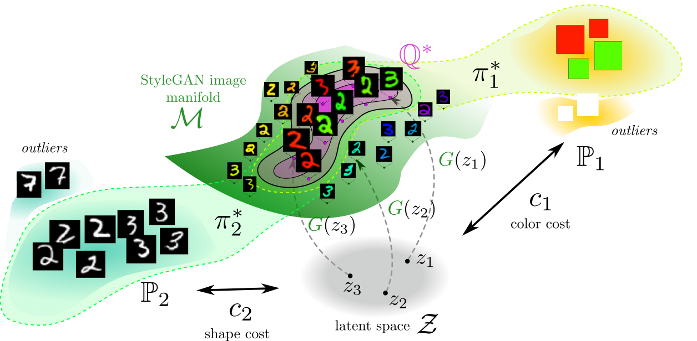
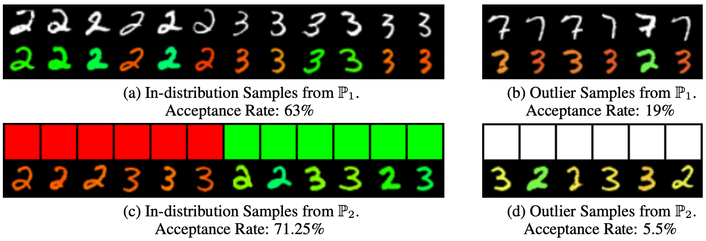

# Robust Barycenter Estimation using Semi-unbalanced Neural Optimal Transport
This is the official `Python` implementation of the [ICLR 2025](https://iclr.cc) paper **Robust Barycenter Estimation using Semi-unbalanced Neural Optimal Transport** by [Milena Gazdieva](https://scholar.google.com/citations?user=h52_Zx8AAAAJ&hl=en), [Jaemoo Choi](https://scholar.google.com/citations?user=Ba2G6sIAAAAJ&hl=en&oi=ao), [Alexander Kolesov](https://scholar.google.com/citations?user=WyAI_wUAAAAJ&hl=en&oi=ao), [Jewoong Choi](https://scholar.google.com/citations?user=e4ZLjREAAAAJ&hl=en&oi=ao), [Petr Mokrov](https://scholar.google.com/citations?user=CRsi4IkAAAAJ&hl=en&oi=ao), [Alexander Korotin](https://scholar.google.ru/citations?user=1rIIvjAAAAAJ&hl=en).

The repository contains reproducible `PyTorch` source code for estimating the *robust* continuous barycenter of distributions, leveraging the dual formulation of the *(semi-)unbalanced* optimal transport (OT) problem. The method (U-NOTB) is based on the usage of neural networks and can be applied in high dimensions. We experimentally show that U-NOTB allows for computing barycenters which are robust to potential outliers and class imbalances in the distributions. Examples are provided for toy (2D) problems and high-dimensional experiments with manipulating images.

<p align="center"></p>

## Related repositories

- [Repository](https://github.com/justkolesov/NOTBarycenters) for [Estimating Barycenters of Distributions with Neural Optimal Transport](https://icml.cc/virtual/2024/poster/32654) paper (ICML 2024).

## Citation
```
@article{gazdieva2024robust,
  title={Robust barycenter estimation using semi-unbalanced neural optimal transport},
  author={Gazdieva, Milena and Choi, Jaemoo and Kolesov, Alexander and Choi, Jaewoong and Mokrov, Petr and Korotin, Alexander},
  journal={International Conference on Learning Representations},
  year={2025}
}
```
## Shape-color Experiment

We illustrate one interesting example demonstrating how our U-NOTB approach can be used to calculate the barycenter of distributions in the case of general costs and presence of outliers in the input distributions. We consider the problem of calculating semi-unbalanced barycenter of distributions of colors ('green'&'red', $\bbP_1$), and grayscale images of digits ('2'&'3', $\bbP_2$) in the latent space of a StyleGAN model pretrained on colored MNIST images of digits '2', '3'. To complexify the exposition, we include a small portion (1%) of outliers both in datasets of colors ('white' color) and grayscales digits (digit '7').

For the first marginal sample $x_1\sim \bbP_1$ and its corresponding barycenter point $y_1$, we use the following \textit{shape-preserving cost}: $c_1(x_1, y_1) = \frac{1}{2} \lVert x_1 - H_g (y_1)\rVert^2$, where $H_g$ is a decolorization operator. For the second marginal sample $x_2 \sim \bbP_2$ and the corresponding barycenter point $y_2$, we use the following \textit{color-preserving cost}: $c_2(x_2, y_2) = \frac{1}{2} \lVert x_2 - H_c (y_2)\rVert^2$, where $H_c$ is a color projection operator defined in \citep{kolesovestimating}.

In this setup, classic OT barycenter of clean datasets (w/o outliers) of colors and shapes corresponds to 'green' and 'red images of digits '2' and '3'. However, the outliers present in these distributions negatively affect the classic barycenter which includes the unnecessary points. Fortunately, our solver allows for successful elimination of outliers in the input distributions.

Examples of grayscale digits, colors and their corresponding barycenter points are showm. The calculated acceptance rates show that U-NOTB solver successfully eliminates the outlier points.

<p align="center"></p>


## Repository structure
The implementation is GPU-based. One GPU RTX 2080Ti is enough to run each of the experiments. Most of the experiments are issued in the form of self-explanatory jupyter notebooks (`notebooks/`). For clarity, most of the evaluation output is preserved. Additional source code in located in `.py` files from `src/`, `torch_utils/`, `dnnlib/` folders and in `legacy.py` file from the root folder.

- `notebooks/Source-fixed-UOTB.ipynb` - toy experiment in Section 5.1.
- `notebooks/Toy_Outlier.ipynb` - toy experiment on the robustness to outliers (Section 5.2).
- `notebooks/Toy_class_imbalance.ipynb` - toy experiment on the robustness to class imbalancedness (Section 5.2).
- `notebooks/StyleGAN.ipynb` - StyleGAN based Shape-Color Experiment on Colored-MNIST (Section 5.3).

Moreover, `train.py` runs the image-to-image translation experiment from young-to-old human faces (Appendix D.3). To run this experiment, you need to download the data from [drive link](https://www.dropbox.com/scl/fo/0z0eusjd00k4fjspil2n3/AJecW5iPqucQL0LaTseIIds?rlkey=ew2pbj89vxc42726snu77fhqk&st=smfg1eqy&dl=0) and locate it in a new `data` in the root directory.

Checkpoints for the trained models also could be found in `.pretrained_models` and `train_logs` folder from [drive link](https://www.dropbox.com/scl/fo/0z0eusjd00k4fjspil2n3/AJecW5iPqucQL0LaTseIIds?rlkey=ew2pbj89vxc42726snu77fhqk&st=smfg1eqy&dl=0).

## Credits

- [Ave,Celeba](https://disk.yandex.ru/d/3jdMxB789v936Q) with faces dataset;
- [MNIST](https://yann.lecun.com/exdb/mnist) with images dataset;
- [UNet architecture](https://github.com/milesial/Pytorch-UNet) for OT map's architecture;
- [ResNet architectures](https://github.com/harryliew/WGAN-QC) for potential's architecture;
- [Flickr-Faces-HQ Dataset](https://github.com/NVlabs/ffhq-dataset) with human faces dataset.